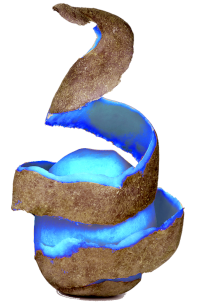

# Blue Potato



[Blue Potato](https://github.com/soprop/blue_potato/tree/dev), un framework MVC léger, léger, et léger, implémentant [Twig](https://twig.symfony.com/doc/2.x/) et [RedBeanORM](https://www.redbeanphp.com/index.php).

- [SopRop](github.com/soprop)
- [Leamundis](github.com/leamundis)
- [QuentinB](github.com/quentinbouvier)

## Table des matières

<!-- TOC -->

- [Blue Potato](#blue-potato)
    - [Table des matières](#table-des-matières)
    - [Get Started](#get-started)
    - [Framework](#framework)
        - [Routing](#routing)
        - [Controllers](#controllers)
        - [Models](#models)
        - [Config](#config)
    - [Front end](#front-end)

<!-- /TOC -->

## Get Started

Clonez Blue Potato depuis le [repo github](https://github.com/SopRop/blue_potato)

La branche master pour une expérience stable. La branche dev pour une expérience instable. La branche sample pour un exemple simple d'utilisation.

Copier le `.env.example` en `.env` à la racine du projet, renseigner les infos pour la base de données

## Framework

### Routing

Blue Potato utilise un système de routes automatiques en interprêtant l'url entrée par l'utilisateur. `http://mywebsite.com/Home/Index` appellera automatiquement la méthode `index()` du controller `HomeController`. Notez que `Home/Index`est la route par défaut, qui sera chargée si aucune route n'est demandée par l'utilisateur.

### Controllers

Les controllers sont le nerfs du transit des données. Ils sont appelés via le premier segment de la route : `/Home` appelera `HomeController`. Le second segment de la route appellera la méthode du controller ci-choisi : `Home/Index` Appellera `Controller\HomeController->index()`.

Les controller héritent de `\Core\Controller`.

Conventions:

- Le controller doit commencer par une Majuscule, et est appelé via un `ucfirst()`. => _HomeController_, _DuckHuntersController_
- Les controllers sont suffixés par __Controller__. => _HomeController_, _UsersController_
- Les actions sont appelées en lowerCamelCase (via `lcfirst()`). Les méthodes du controller doivent être écrites de manière à concorder avec la fonction (à l'exception du premier caractère qui est case INsensitive).

### Models

Les _model_ héritent de `\Core\Model`.

Le nom du _model_ doit correspondre au nom de la table correspondante dans la base de données.

Chaque fonction est appelée de manière statique via le nom du modèle. _`ModelName::getAll()`_

Fonctions:

- getAll()
- getByProperty($column, $value) => Effectue une recherche via `LIKE` dans la table
- getByID($id)
- numberOf() => `COUNT`

### Config

`env($name, $default)` pour charger un paramètre depuis le .env avec une valeur par défaut.

Pour plus de classe, renseigner les settings dans `/config/main.php`, en y accédant ensuite via `conf($name)` dans le projet.

## Front end

Blue Potato bundle et minifie votre JS et votre SASS depuis les dossiers `Views/resources/{css,js}` vers `public/{css,js}`.

Chargez vos ressources dans vos vues depuis la route la plus simple :

```html
<link rel="stylesheet" type="text/css" href="css/mystyle.css">
<script type="text/javascript" src="js/built.min.js"></script>
```

Pour cela, toute une gamme de tâches grunt, et un watch incroyable de puissance.

Installez `grunt-cli`

```shell
npm install grunt-cli --global
```

Installez vos dépendances node :

```shell
cd /Path/to/blue_potato/project/root
npm install
```

Lancez vos tâches :

```shell
grunt dev # Compile le sass et exporte le css. Concat et minifie le js. Copie les assets dans le dossier public
grunt # Comme dev, plus un watch de ouf
```